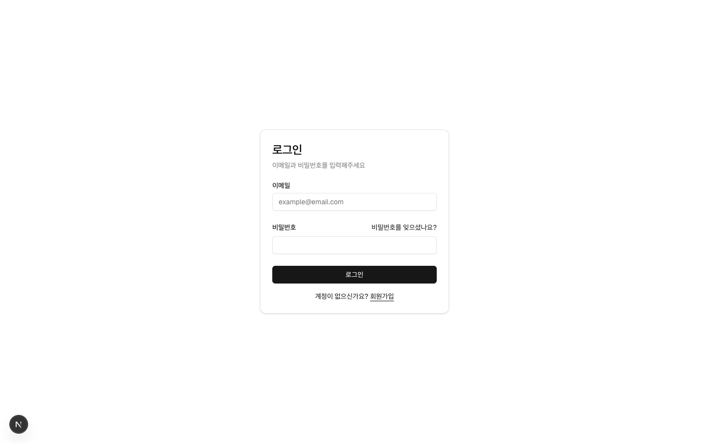
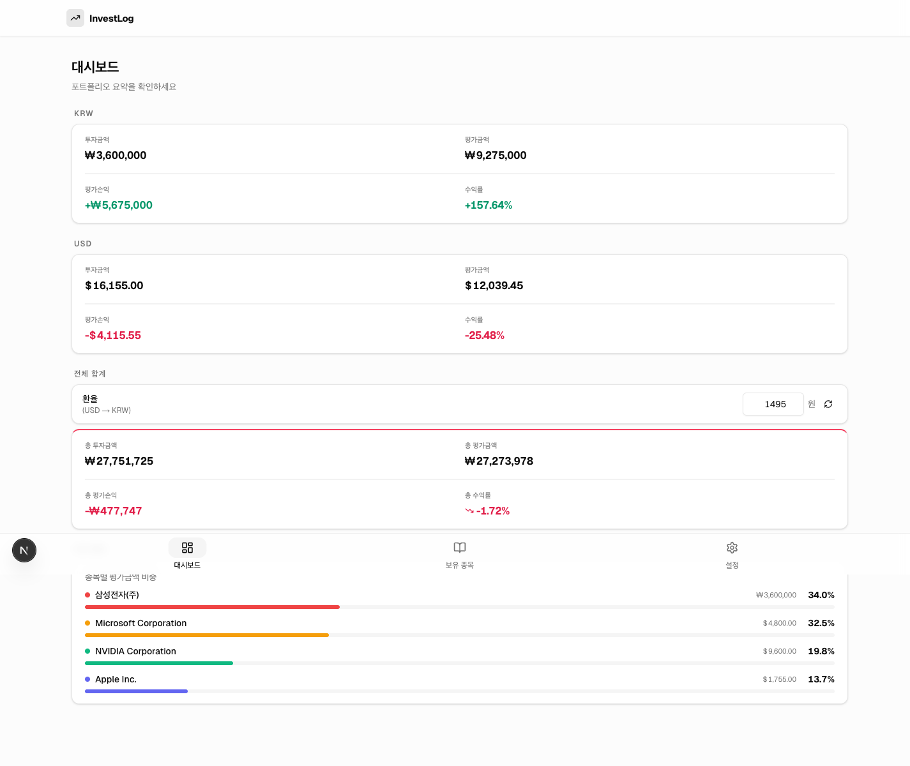
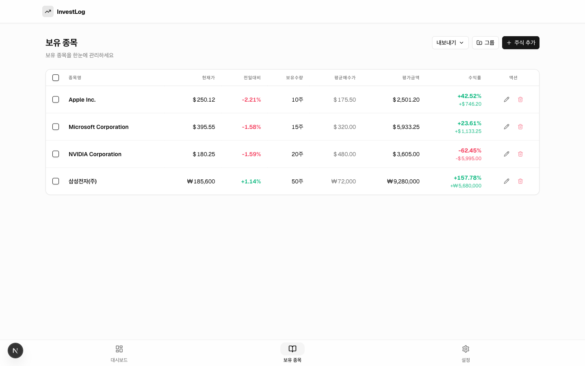
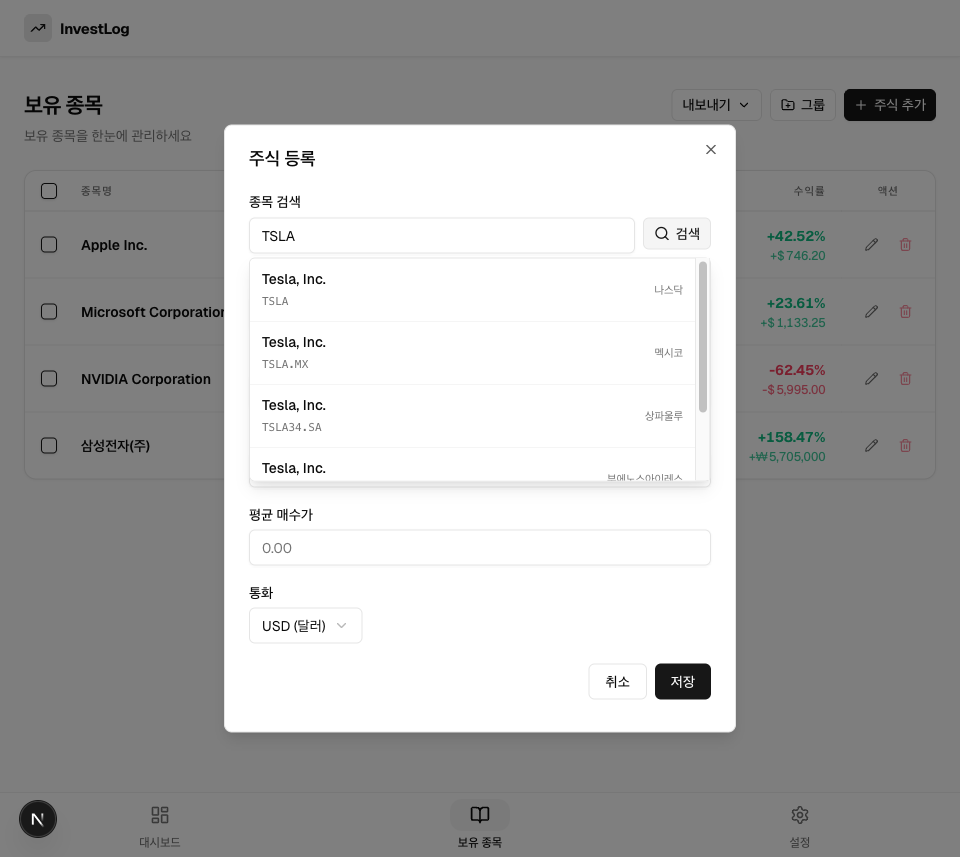
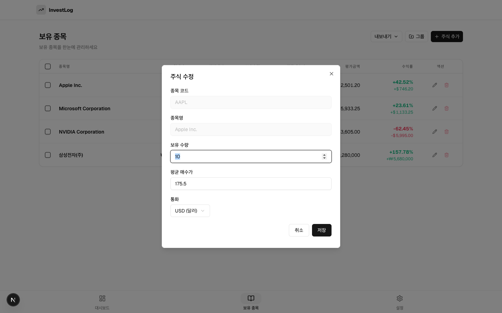

# FinLog — 개인 투자 포트폴리오 관리 앱

**FinLog**는 해외주식·국내주식을 함께 관리할 수 있는 개인 투자 기록 웹 앱입니다.
Yahoo Finance API와 연동하여 실시간 현재가·환율을 조회하고, USD/KRW 통화별 손익 및 가중평균 수익률을 계산합니다.
Next.js 15 App Router + Supabase 기반의 풀스택 구조로 설계되었으며, PWA로 모바일에서도 사용할 수 있습니다.

---

## 목차

1. [프로젝트 개요](#1-프로젝트-개요)
2. [핵심 기능](#2-핵심-기능)
3. [기술 스택](#3-기술-스택)
4. [아키텍처](#4-아키텍처)
5. [폴더 구조](#5-폴더-구조)
6. [주요 비즈니스 로직](#6-주요-비즈니스-로직)
7. [API 설계](#7-api-설계)
8. [데이터베이스 스키마](#8-데이터베이스-스키마)
9. [인증 흐름](#9-인증-흐름)
10. [화면 구성](#10-화면-구성)
11. [로컬 환경 설정](#11-로컬-환경-설정)
12. [개발 가이드](#12-개발-가이드)

---

## 1. 프로젝트 개요

해외주식과 국내주식을 동시에 보유하는 투자자는 두 가지 문제에 직면합니다.

1. **통화 혼재**: USD 종목과 KRW 종목의 손익을 하나의 지표로 통합하기 어렵습니다.
2. **정보 분산**: 여러 증권사 앱을 오가며 전체 포트폴리오를 파악해야 합니다.

FinLog는 이 두 가지를 해결합니다. Yahoo Finance API를 통해 전 세계 상장 종목을 지원하고, 실시간 환율로 KRW 환산 통합 손익을 즉시 확인할 수 있습니다.

**개발 단계**

| 단계 | 상태 | 내용 |
|------|------|------|
| Phase 1 | 완료 | Supabase DB CRUD, Yahoo Finance 현재가/환율/검색 연동, 수익률 계산, 그룹 관리 |
| Phase 2 | 예정 | 배당금 추적, 매매 이력, 포트폴리오 비교, 고급 차트 |

---

## 2. 핵심 기능

**포트폴리오 관리**
- 종목 추가 / 수정 / 삭제 (ticker 기반)
- 동일 티커 추가 시 **가중평균 매수가 자동 재계산** 및 수량 합산
- 종목을 색상 태그 기반 **그룹**으로 분류

**실시간 시세 연동**
- Yahoo Finance API로 현재가·전일대비 변동률 조회
- USD/KRW 환율 자동 조회 (수동 입력도 가능)
- 종목 이름 또는 티커로 전 세계 주식 검색

**손익 분석**
- 종목별 평가금액, 평가손익, 수익률 계산
- USD/KRW **통화별 분리 합산** — 혼산 오류 방지
- 환율 적용 **통합 KRW 기준 손익** 표시
- 투자금액 비중 **가중 평균 수익률** 계산

**시각화 및 내보내기**
- 종목별 자산 배분 비율 차트
- 그룹 탭 필터로 분류 별 현황 확인
- CSV / PDF 내보내기

**기타**
- 모바일 PWA (홈 화면 추가, Safe Area 지원)
- 다크 모드

---

## 3. 기술 스택

### Frontend

| 기술 | 선택 이유 |
|------|----------|
| **Next.js 15** (App Router) | Server Components로 초기 데이터를 서버에서 패칭하고 Client Components에서 인터랙션 처리. Fluid Compute 환경에 최적화된 구조 적용 |
| **React 19** | Concurrent Features, `useTransition`으로 비동기 Server Action 중 UI 블로킹 방지 |
| **TypeScript 5** | Supabase 자동 생성 타입을 그대로 활용. 런타임 오류를 컴파일 타임에 차단 |
| **Tailwind CSS v3** | 유틸리티 클래스 기반 반응형 UI. `tailwindcss-animate`로 모달 애니메이션 처리 |
| **shadcn/ui** | Radix UI 기반 접근성 보장 컴포넌트. new-york 스타일, neutral 베이스 컬러 적용 |
| **lucide-react** | 일관된 아이콘 세트. Tree-shaking으로 번들 크기 최소화 |
| **next-themes** | 다크 모드. SSR 하이드레이션 불일치 없는 방식으로 구현 |

### 폼 처리

| 기술 | 선택 이유 |
|------|----------|
| **React Hook Form v7** | 비제어 컴포넌트 방식으로 리렌더링 최소화 |
| **Zod v4** | 런타임 유효성 검사와 TypeScript 타입 추론을 동시에 처리 |
| **@hookform/resolvers v5** | Zod Standard Schema 어댑터 (`standardSchemaResolver`). `z.coerce` 없이 네이티브 타입 추론 |

### Backend / Database

| 기술 | 선택 이유 |
|------|----------|
| **Supabase** | PostgreSQL 기반 관계형 DB. Row Level Security(RLS)로 사용자별 데이터 격리. Auth 내장으로 인증 구현 부담 감소 |
| **Next.js Server Actions** | 별도 API 엔드포인트 없이 서버 사이드 DB 작업 처리. `revalidatePath`로 캐시 무효화 |
| **Route Handlers** | Yahoo Finance 등 외부 API 호출을 서버에서 중계 (CORS 우회, API 키 보호) |

### 외부 API

| 서비스 | 용도 |
|--------|------|
| **Yahoo Finance (비공식)** | 현재가, 전일대비 변동률, 종목 검색, 환율, 시계열 데이터 |

### Deployment / Infra

| 기술 | 선택 이유 |
|------|----------|
| **Vercel** | Next.js 최적화 호스팅. Edge Middleware, Fluid Compute 지원 |
| **Supabase Cloud** | 관리형 PostgreSQL. 연결 풀링, 실시간 구독 지원 |

---

## 4. 아키텍처

### 렌더링 전략

```
Browser
  │
  ├── Page (Server Component)
  │     ├── getPortfolios()         ← Supabase Server Action (서버에서 초기 데이터 패칭)
  │     ├── getGroups()
  │     └── <PortfolioClient ... /> ← Client Component에 데이터 prop으로 전달
  │
  └── PortfolioClient (Client Component)
        ├── useState(portfolios)    ← 낙관적 업데이트로 즉각 UI 반영
        ├── fetch("/api/stock-price") ← 현재가 병렬 요청 (Promise.allSettled)
        └── Server Actions 호출    ← createPortfolio, updatePortfolio, deletePortfolio
```

서버 컴포넌트에서 DB 데이터를 가져온 뒤 클라이언트 컴포넌트로 전달합니다. 클라이언트에서는 Server Action을 통해 DB를 변경하고, `revalidatePath`로 캐시를 무효화해 다음 접근 시 최신 데이터를 보장합니다.

### 통화 처리 설계

```
USD 종목                KRW 종목
   │                       │
   ▼                       ▼
totalInvest.usd        totalInvest.krw
totalEval.usd          totalEval.krw
   │                       │
   └──────────┬────────────┘
              │ × exchangeRate
              ▼
    통합 KRW 손익 / 가중평균 수익률
```

USD와 KRW를 별도로 합산한 후, 환율을 적용해 통합 지표를 산출합니다. 환율 미입력 시에는 통합 지표를 표시하지 않고 통화별 수치만 노출합니다.

---

## 5. 폴더 구조

```
my-invest-log-app/
│
├── app/
│   ├── layout.tsx                     # 글로벌 레이아웃 (ThemeProvider)
│   ├── page.tsx                       # 루트 → /auth/login 리다이렉트
│   │
│   ├── auth/                          # 인증 페이지
│   │   ├── login/page.tsx
│   │   ├── sign-up/page.tsx
│   │   ├── forgot-password/page.tsx
│   │   ├── update-password/page.tsx
│   │   ├── confirm/route.ts           # 이메일 OTP 검증 Route Handler
│   │   └── error/page.tsx
│   │
│   ├── (protected)/                   # 인증 가드 레이아웃 그룹
│   │   ├── layout.tsx                 # Header + BottomNav
│   │   ├── dashboard/
│   │   │   ├── page.tsx               # Server Component (초기 데이터 패칭)
│   │   │   └── DashboardClient.tsx    # 요약 카드, 환율, 자산 배분 차트
│   │   ├── portfolio/
│   │   │   ├── page.tsx               # Server Component
│   │   │   └── PortfolioClient.tsx    # 종목 테이블, CRUD, CSV/PDF 내보내기
│   │   └── settings/page.tsx
│   │
│   ├── actions/
│   │   ├── portfolio.ts               # 종목 CRUD Server Actions
│   │   └── group.ts                   # 그룹 CRUD Server Actions
│   │
│   ├── api/
│   │   ├── stock-price/route.ts       # Yahoo Finance 현재가 조회
│   │   ├── exchange-rate/route.ts     # USD/KRW 환율 조회
│   │   ├── stock-search/route.ts      # 종목 검색
│   │   └── stock-history/route.ts     # 시계열 데이터 (차트용)
│   │
│   └── manifest.ts                    # PWA Manifest 자동 생성
│
├── components/
│   ├── layout/
│   │   ├── Header.tsx
│   │   └── BottomNav.tsx              # 하단 탭바 (모바일 Safe Area 대응)
│   │
│   ├── portfolio/
│   │   ├── StockAddModal.tsx          # 종목 추가 (검색 → 자동 입력)
│   │   ├── StockEditModal.tsx         # 종목 수정 (그룹 변경 포함)
│   │   ├── StockDetailModal.tsx       # 종목 상세 (시계열 차트)
│   │   └── GroupModal.tsx             # 그룹 생성/수정
│   │
│   └── ui/                            # shadcn/ui 컴포넌트
│
├── lib/
│   ├── calculate.ts                   # 수익률 · 손익 계산 핵심 로직
│   ├── format.ts                      # 통화 포맷 (USD/KRW)
│   ├── mock-data.ts                   # Phase 1 테스트 데이터
│   └── supabase/
│       ├── server.ts                  # 서버 클라이언트 (Server Components / Actions)
│       ├── client.ts                  # 브라우저 클라이언트 (Client Components)
│       ├── proxy.ts                   # 세션 갱신 + 라우팅 가드
│       └── database.types.ts          # 자동 생성 타입
│
├── types/
│   └── portfolio.ts                   # 도메인 타입 정의
│
├── schemas/
│   └── portfolio.ts                   # Zod 폼 스키마
│
└── middleware.ts                      # Next.js Middleware (인증 인터셉터)
```

---

## 6. 주요 비즈니스 로직

### 6.1 수익률 계산 (`lib/calculate.ts`)

**개별 종목 계산**

```typescript
// 수익률 (%)
export function calcProfitRate(avgPrice: number, currentPrice: number): number {
  return ((currentPrice - avgPrice) / avgPrice) * 100;
}

// 평가금액
export function calcEvalAmount(currentPrice: number, quantity: number): number {
  return currentPrice * quantity;
}

// 평가손익
export function calcProfitAmount(
  avgPrice: number,
  currentPrice: number,
  quantity: number,
): number {
  return (currentPrice - avgPrice) * quantity;
}
```

**포트폴리오 전체 가중 평균 수익률**

단순 평균이 아닌 **투자금액 비중 가중 평균**으로 계산합니다.
투자 비중이 큰 종목이 전체 수익률에 더 많은 영향을 줍니다.

```typescript
export function calcTotalProfitRate(
  portfolios: PortfolioWithPrice[],
): number {
  const totalInvest = portfolios.reduce(
    (sum, p) => sum + p.avg_price * p.quantity,
    0,
  );
  if (totalInvest === 0) return 0;

  return portfolios.reduce((acc, p) => {
    const weight = (p.avg_price * p.quantity) / totalInvest;  // 투자금액 비중
    const rate = calcProfitRate(
      p.avg_price,
      p.current_price ?? p.avg_price,  // 현재가 미설정 시 avg_price로 폴백
    );
    return acc + weight * rate;
  }, 0);
}
```

### 6.2 종목 추가 시 자동 병합 (`app/actions/portfolio.ts`)

동일 티커를 재매수하면 별도 레코드를 만들지 않고 **가중평균 매수가를 재계산**해 기존 레코드를 업데이트합니다.

```typescript
export async function createPortfolio(data: PortfolioFormValues) {
  // 기존 동일 티커 조회
  const { data: existing } = await supabase
    .from("portfolios")
    .select("id, quantity, avg_price")
    .eq("user_id", user.id)
    .eq("ticker", data.ticker)
    .single();

  if (existing) {
    const totalQuantity = existing.quantity + data.quantity;
    const newAvgPrice =
      (existing.quantity * existing.avg_price + data.quantity * data.avg_price)
      / totalQuantity;

    await supabase.from("portfolios").update({
      quantity: totalQuantity,
      avg_price: Math.round(newAvgPrice * 10000) / 10000,
    }).eq("id", existing.id);

    return { success: true, merged: true };
  }

  // 신규 종목 INSERT
  await supabase.from("portfolios").insert({ ...data, user_id: user.id });
  return { success: true, merged: false };
}
```

### 6.3 현재가 병렬 조회

대시보드/포트폴리오 마운트 시, 모든 종목의 현재가를 **동시에** 요청합니다.
개별 요청 실패가 전체를 블로킹하지 않도록 `Promise.allSettled`를 사용합니다.

```typescript
const results = await Promise.allSettled(
  portfolios.map((p) =>
    fetch(`/api/stock-price?ticker=${p.ticker}`).then((r) => r.json()),
  ),
);

const priceMap: Record<string, number> = {};
results.forEach((result, i) => {
  if (result.status === "fulfilled" && result.value.price) {
    priceMap[portfolios[i].ticker] = result.value.price;
  }
});
```

### 6.4 통화별 분리 합산

USD 종목과 KRW 종목을 혼산하지 않고 통화별로 분리해 계산합니다.

```typescript
export function calcTotalInvestAmount(portfolios: PortfolioWithPrice[]) {
  return portfolios.reduce(
    (acc, p) => {
      const invest = p.avg_price * p.quantity;
      if (p.currency === "USD") acc.usd += invest;
      else acc.krw += invest;
      return acc;
    },
    { usd: 0, krw: 0 },
  );
}
```

환율이 입력된 경우에만 통합 KRW 기준 손익을 산출합니다.

```typescript
const combinedInvest = totalInvest.krw + totalInvest.usd * exchangeRate;
const combinedEval   = totalEval.krw   + totalEval.usd   * exchangeRate;
const combinedProfit = combinedEval - combinedInvest;
const combinedRate   = (combinedProfit / combinedInvest) * 100;
```

### 6.5 폼 유효성 검사 (`schemas/portfolio.ts`)

Zod v4 + `standardSchemaResolver`를 조합합니다.
`z.coerce.number()` 대신 `z.number()`를 사용해 resolvers v5 타입 추론 호환성을 유지합니다.

```typescript
export const portfolioFormSchema = z.object({
  ticker:   z.string().min(1, "종목코드를 입력해주세요"),
  name:     z.string().min(1, "종목명을 입력해주세요"),
  quantity: z.number({ error: "보유 수량을 입력해주세요" })
             .positive("보유 수량은 0보다 커야 합니다"),
  avg_price: z.number({ error: "매수가를 입력해주세요" })
              .positive("매수가는 0보다 커야 합니다"),
  currency: z.enum(["KRW", "USD"]),
  group_id: z.string().nullable().optional(),
});
```

---

## 7. API 설계

외부 Yahoo Finance API는 CORS 제한 및 API 키 보호를 위해 모두 **Next.js Route Handler를 경유**해 호출합니다.

### `GET /api/stock-price`

현재가 및 전일대비 변동률을 조회합니다.

| 파라미터 | 타입 | 설명 |
|---------|------|------|
| `ticker` | string | 종목 코드 (예: `AAPL`, `005930.KS`) |

```json
// 응답 예시
{
  "ticker": "AAPL",
  "price": 189.50,
  "changePercent": 1.24,
  "prevClose": 187.17,
  "name": "Apple Inc.",
  "currency": "USD"
}
```

한국 주식(`.KS`, `.KQ`)은 원화 로케일 자동 설정. 타임아웃 3초.

---

### `GET /api/exchange-rate`

실시간 USD/KRW 환율을 조회합니다. Yahoo Finance의 `KRW=X` 티커를 활용합니다.

```json
// 응답 예시
{ "rate": 1378 }
```

---

### `GET /api/stock-search`

종목명 또는 티커로 검색합니다. EQUITY, ETF 타입만 필터링하며 최대 8개를 반환합니다.

| 파라미터 | 타입 | 설명 |
|---------|------|------|
| `q` | string | 검색어 (예: `samsung`, `AAPL`, `005930.KS`) |

```json
// 응답 예시
{
  "results": [
    { "ticker": "AAPL", "name": "Apple Inc.", "exchange": "NMS" },
    { "ticker": "AAPL.BA", "name": "Apple Inc.", "exchange": "BUE" }
  ]
}
```

> 한글 검색은 지원되지 않습니다. 영문명(`samsung`, `apple`) 또는 티커(`005930.KS`)로 검색하세요.

---

### `GET /api/stock-history`

종목의 시계열 가격 데이터를 조회합니다. 상세 모달 차트에서 사용합니다.

| 파라미터 | 타입 | 허용값 |
|---------|------|--------|
| `ticker` | string | 종목 코드 |
| `range` | string | `1d`, `5d`, `1mo`, `3mo`, `6mo`, `1y` |

```json
// 응답 예시
{
  "data": [
    { "date": "2025-01-02", "close": 182.50 },
    { "date": "2025-01-03", "close": 184.20 }
  ]
}
```

---

## 8. 데이터베이스 스키마

### `portfolios`

| 컬럼 | 타입 | 설명 |
|------|------|------|
| `id` | `uuid` | PK (자동 생성) |
| `user_id` | `uuid` | FK → `auth.users` |
| `ticker` | `text` | 종목 코드 (`AAPL`, `005930.KS`) |
| `name` | `text` | 종목명 |
| `quantity` | `numeric` | 보유 수량 (소수점 4자리) |
| `avg_price` | `numeric` | 평균 매수가 |
| `currency` | `text` | `"KRW"` \| `"USD"` |
| `group_id` | `uuid \| null` | FK → `portfolio_groups` |
| `created_at` | `timestamptz` | |
| `updated_at` | `timestamptz` | |

### `portfolio_groups`

| 컬럼 | 타입 | 설명 |
|------|------|------|
| `id` | `uuid` | PK |
| `user_id` | `uuid` | FK → `auth.users` |
| `name` | `text` | 그룹명 (최대 30자) |
| `color` | `text` | HEX 색상 코드 (`#RRGGBB`) |
| `created_at` | `timestamptz` | |

**RLS 정책**: `user_id = auth.uid()` 조건으로 자신의 데이터에만 접근 가능.

### 타입 계층

```
Tables<"portfolios">          ← lib/supabase/database.types.ts (자동 생성)
  └─ Portfolio                ← types/portfolio.ts (re-export)
       └─ PortfolioWithPrice  ← Portfolio & { current_price?: number }

PortfolioFormValues           ← schemas/portfolio.ts (Zod infer)
```

---

## 9. 인증 흐름

### Middleware 처리 (`middleware.ts` → `lib/supabase/proxy.ts`)

```
Request
  │
  ▼
middleware.ts
  │
  ▼
updateSession() — proxy.ts
  ├─ supabase.auth.getClaims()로 세션 검증
  ├─ 인증된 사용자 + "/" 접근   → /dashboard 리다이렉트
  ├─ 미인증 사용자 + 보호 경로   → /auth/login 리다이렉트
  └─ PWA 리소스 (manifest, icon) → 인증 없이 허용
```

### 경로 분류

| 구분 | 경로 |
|------|------|
| 공개 | `/`, `/auth/**` |
| 보호 | `/dashboard`, `/portfolio`, `/settings` |
| PWA 공개 | `/manifest.webmanifest`, `/apple-touch-icon.png`, `/icon-*.png` |

### Supabase 클라이언트 패턴

```typescript
// Server Components / Server Actions / Route Handlers
// → 매 호출마다 새 인스턴스 생성 (Fluid Compute 요구사항)
const supabase = await createClient();  // lib/supabase/server.ts

// Client Components
const supabase = createClient();        // lib/supabase/client.ts
```

---

## 10. 화면 구성

### 로그인 (`/auth/login`)



이메일/비밀번호 로그인, 회원가입, 비밀번호 찾기 링크를 제공합니다.
Supabase Auth 기반으로 이메일 OTP 인증을 지원합니다.

---

### 대시보드 (`/dashboard`)



포트폴리오 전체 현황을 한눈에 확인합니다.

| 구성 요소 | 설명 |
|----------|------|
| KRW 요약 카드 | 원화 종목의 투자금액, 평가금액, 평가손익, 수익률 |
| USD 요약 카드 | 달러 종목의 투자금액, 평가금액, 평가손익, 수익률 |
| 전체 합계 카드 | 환율 적용 KRW 기준 통합 손익 및 총 수익률 |
| 환율 입력 | 자동 조회 버튼 또는 수동 입력 — USD → KRW 환산에 사용 |
| 자산 배분 차트 | 종목별 평가금액 비중 바 시각화 |

---

### 보유 종목 (`/portfolio`)



전체 보유 종목을 테이블로 관리합니다.

| 구성 요소 | 설명 |
|----------|------|
| 종목 테이블 | 종목명, 현재가, 전일대비, 보유수량, 평균매수가, 평가금액, 수익률 |
| 수익/손실 색상 | 양수(초록), 음수(빨강)로 직관적 구분 |
| 종목 추가 | 검색 → 자동 입력 → 수량/단가 입력 → 저장 |
| 종목 수정 | 수량, 평균가, 통화, 그룹 변경 |
| 내보내기 | 다중 선택 후 CSV / PDF 다운로드 |

모바일에서는 카드 형태로, 데스크톱에서는 테이블 형태로 렌더링됩니다.

---

### 종목 추가 모달



종목명 또는 티커를 입력하면 Yahoo Finance 검색 결과가 드롭다운으로 표시됩니다.
결과 선택 시 종목 코드, 종목명, 통화가 자동으로 입력됩니다.

---

### 종목 수정 모달



종목 코드와 종목명은 읽기 전용이며, 보유 수량·평균 매수가·통화·그룹을 수정할 수 있습니다.

---

### 종목 추가 플로우

```
검색창 입력 ("apple")
      │
      ▼
/api/stock-search  →  드롭다운 표시
      │
      ▼ 결과 선택 (Apple Inc. / AAPL)
      │
    자동 입력: ticker="AAPL", name="Apple Inc."
    /api/stock-price 호출 → currency="USD" 자동 설정
      │
      ▼
수량 / 평균 매수가 입력
      │
      ▼
저장 → createPortfolio() → DB INSERT (또는 기존 티커 병합)
```

---

## 11. 로컬 환경 설정

### 사전 요구사항

- Node.js 18 이상
- Supabase 프로젝트 ([supabase.com](https://supabase.com)에서 생성)

### 설치

```bash
git clone https://github.com/your-username/my-invest-log-app.git
cd my-invest-log-app
npm install
```

### 환경 변수

`.env.local` 파일을 생성하고 아래 값을 설정합니다.

```env
NEXT_PUBLIC_SUPABASE_URL=https://your-project-id.supabase.co
NEXT_PUBLIC_SUPABASE_PUBLISHABLE_KEY=your-anon-or-publishable-key
```

> Supabase 프로젝트의 API 설정에서 `Project URL`과 `publishable key`(또는 `anon key`)를 확인할 수 있습니다.

### 실행

```bash
npm run dev
# http://localhost:3000
```

### Supabase 타입 재생성

DB 스키마 변경 후 TypeScript 타입을 업데이트합니다.

```bash
npx supabase gen types typescript --project-id <your-project-id> \
  > lib/supabase/database.types.ts
```

---

## 12. 개발 가이드

### 명령어

```bash
npm run dev      # 개발 서버 (localhost:3000, HMR 활성화)
npm run build    # 프로덕션 빌드
npm run lint     # ESLint 검사
```

### 컴포넌트 추가

shadcn/ui 컴포넌트는 다음 명령으로 추가합니다.

```bash
npx shadcn@latest add <component-name>
```

### 모달 컴포넌트 패턴

`components/portfolio/` 하위 모달은 `trigger` prop으로 트리거 요소를 외부에서 주입받습니다. 이를 통해 모달과 트리거 버튼의 위치를 분리할 수 있습니다.

```tsx
<StockEditModal
  trigger={<Button variant="ghost" size="icon-sm"><Pencil /></Button>}
  portfolio={portfolio}
  groups={groups}
  onSubmit={handleEditStock}
/>
```

### 경로 Alias

```
@/components  →  components/
@/lib         →  lib/
@/types       →  types/
@/schemas     →  schemas/
@/hooks       →  hooks/
```

### 코드 컨벤션

| 항목 | 규칙 |
|------|------|
| 변수/함수명 | 영어 camelCase |
| 컴포넌트명 | PascalCase |
| 주석 | 한국어 |
| 커밋 메시지 | 한국어 (`feat:`, `fix:`, `refactor:` 접두사) |

---

## 라이선스

MIT
